# Estudo de Caso "TechFix"

## Contexto:

A atividade realizada em sala de aula envolveu o desenvolvimento do Product Backlog Building (PBB) para a TechFix, uma empresa especializada em suporte técnico e manutenção de equipamentos para clientes corporativos e residenciais. Apesar de sua reconhecida expertise, a TechFix enfrenta desafios que comprometem sua reputação e eficiência operacional.

> Baseado em "Exercício de Construção de Backlog de Produto usando PBB (Product Backlog Building)" passado em sala de aula pelo Prof. Dr. George Marsicano

Atividade realizada no MURAL, template feito por Fábio Aguiar, acesse [por aqui.](https://app.mural.co/t/paolaa3026/m/paolaa3026/1736422556978/40e12132ed94e691a217f3b1c2971668f1b821ab?sender=u14beb7775f588ca67f430727)

## Identificação do Produto:

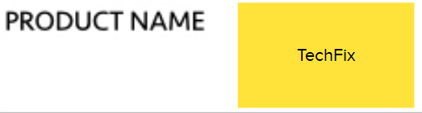

## Problemas:

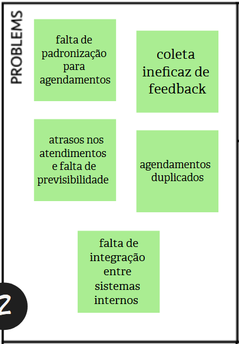

## Expectativas:

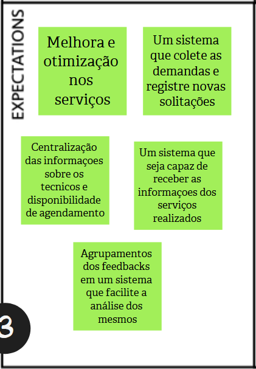

## Personas:

### Persona 1: Carlos
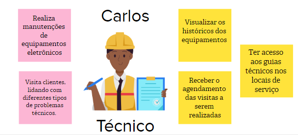
### Persona 2: Ana
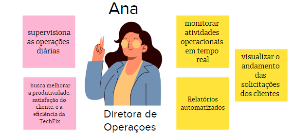
### Persona 3: Rafael
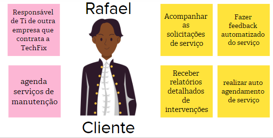

## Funcionalidades:

### Funcionalidades Carlos
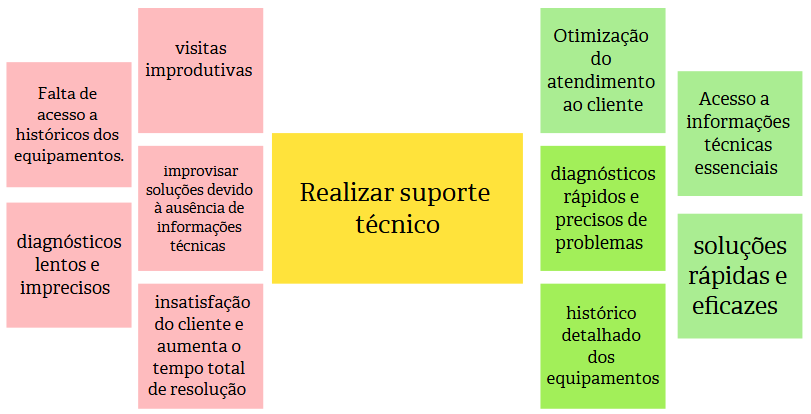
### Funcionalidades Ana
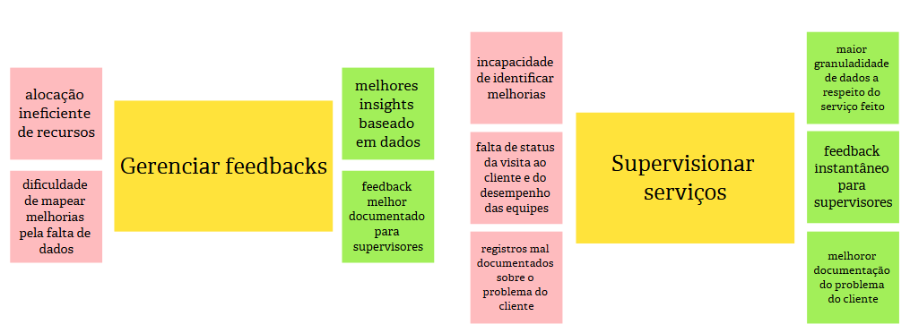
### Funcionalidades Rafael
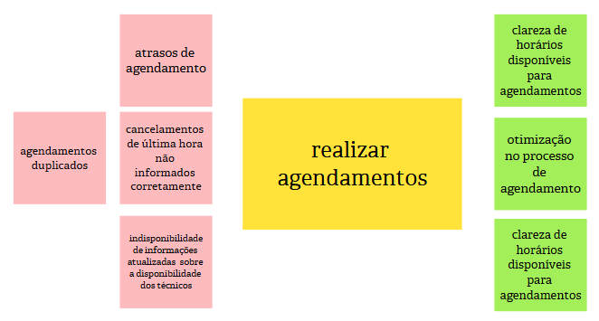

## PBI:

### PBI Carlos
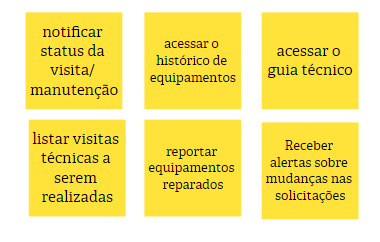
### PBI Ana
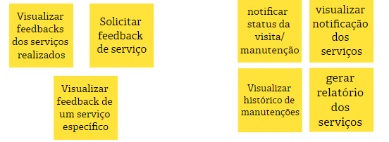
### PBI Rafael
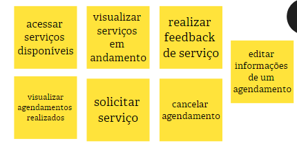

## Histórias de Usuários:

### US01 - Notificar status da visita

>Eu, como técnico, quero notificar o status da visita para que a diretora de operações tenha informações do andamento do meu serviço.

Critérios de Aceitação: 

* O técnico deve ser capaz de criar uma mensagem notificando o status da visita, com campos para o título, descrição, data e hora da visita.  
* O técnico deve poder enviar a notificação apenas após preencher todos os campos obrigatórios (título, descrição, data e hora da visita).  
* Todos os campos obrigatórios devem ser validados antes do envio, exibindo mensagens de erro em caso de informações inválidas (ex.: data ou hora que não correspondem ao horário marcado para a visita).  

Cenário: Técnico notifica o status da visita

**Dado que** o técnico está visualizando uma visita agendada,  
**Quando** ele seleciona a visita e adiciona uma notificação a ela, inserindo o título "Central das Máquinas", a descrição "Visita realizada com sucesso!", a data "20/01/2025" e o horário "14:00",   
**Então** o sistema deve notificar os envolvidos com a mensagem de status da visita.  

### US02 - Acessar histórico de equipamentos

>Eu, como técnico, quero acessar o histórico de um equipamento para realizar diagnósticos rápido e mais preciso sobre o equipamento. 

Critérios de Aceitação: 

* O técnico deve ser capaz de visualizar o histórico completo de manutenção do equipamento selecionado.  
* O histórico deve incluir as seguintes informações: as datas das manutenções anteriores, o técnico que realizou a manutenção, a descrição do problema e solução aplicada.  
* O técnico deve ser capaz de filtrar o histórico por tipo de equipamento ou data.  

Cenário: Técnico acessa o histórico de equipamentos

**Dado que** que o técnico está na página de equipamentos,  
**Quando** ele seleciona o equipamento "Notebook ASUS" do cliente "Gerônimo Peças",    
**Então** o sistema deve exibir a data da última manutenção como "07/12/2024" e o horário como "15:00".  

### US03 - Acessar guia técnico

>Eu, como técnico, quero acessar o guia técnico para ter acesso as informaçoes e procedimentos dos equipamentos.

Critérios de Aceitação: 

* O técnico deve poder visualizar uma lista dos guias técnicos disponiveís.  
* O técnico deve poder buscar informações específicas dentro do guia através de uma barra de pesquisa, na qual ele deve digitar o nome do guia técnico ou o nome de um equipamento.  
* O sistema deve registrar um histórico dos guias técnicos acessados recentemente pelo técnico para facilitar consultas recorrentes.  

Cenário: Técnico acessa o guia técnico

**Dado que** que o técnico está na página do guia,  
**Quando** ele seleciona o "Guia Técnico Linux 2024",  
**Então** o sistema deve exibir um guia com procedimentos e normas técnicos do Linux e a versão do guia deve ser a de 2024.  

### US04 - Listar visitas a serem realizadas

>Eu, como técnico, quero listar visitas técnicas a serem realizadas para visualizar os detalhes das mesmas.

Critérios de Aceitação: 

* As visitas devem estar organizadas por data e prioridade.  
* O técnico deve poder visualizar detalhes de cada visita, incluindo informações do cliente (nome e endereço) e serviço.  
* O sistema não deve mostrar visitas que forão canceladas.  

Cenário: Técnico lista visitas a serem realizadas

**Dado que** o técnico está na página de visitas,  
**Quando** ele acessa a lista de visitas agendadas do dia "21/01/2025" e escolhe a visita marcada às "8:00",  
**Então** ele visualiza o nome do cliente que receberá a visita: "Maria Amanda", o serviço que deve ser feito: "Reparo no computador" e o endereço: "Via Norte, Rua Beija-flor, casa 10".  

### US05 - Reportar equipamentos reparados

>Eu como técnico quero reportar equipamentos reparados para atualizar o sistema e notificar o diretor de operações.

Critérios de Aceitação: 

* O técnico deve ser capaz de reportar equipamentos reparados, incluindo a descrição do reparo e uma foto do equipamento.
* O sistema deve atualizar o status do equipamento para "Reparado" após o reparo.

Cenário : Técnico reporta equipamentos reparados

**Dado que** o técnico finalizou o reparo de um equipamento,  
**Quando** ele insere as informações em nome do equipamento "Impressora 3D" e marca o equipamento como "Reparado",  
**Então** o sistema deve registrar o reparo e atualizar o status do equipamento para "Reparado".  

### US06 - Gerar relatório de serviço

>Eu, como técnico, quero gerar relatório do serviço realizado para informar e atualizar o sistema.

Critérios de Aceitação: 

* O técnico deve poder gerar relatório detalhado sobre o serviço realizado, incluindo manutenções e reparos.
* Os relatórios devem incluir data, hora, localização do serviço, nome do cliente, descrição do serviço, equipamentos envolvidos e status.
* O sistema deve permitir exportar o relatório em PDF.

### US07 - Visualizar feedback geral dos serviços 

>Eu, como diretora de operações, quero visualizar feedbacks dos serviços realizados para obter melhores insights baseado em nos dados obtidos.

Critérios de Aceitação: 

* A diretora de operações deve poder acessar todos os feedbacks recebidos sobre os serviços realizados.
* Os feedbacks devem estar organizados por data e serviço.
* A diretora deve poder filtrar feedbacks por tipo de serviço, data ou técnico.

### US08 - Acessar dashboard de feedbacks

>Eu, como diretora de operações, quero acessar o dashboard de feedbacks para melhor avaliação de desempenho dos serviços.

Critérios de Aceitação: 

* O dashboard deve estar acessível por meio de um botão no menu de feedbacks.
* O dashboard deve carregar os dados de feedbacks automaticamente ao ser acessado, exibindo informações atualizadas.
* A diretora deve poder aplicar filtros no dashboard para personalizar a exibição dos dados como tipo de serviço, técnico responsável e data de serviço.

### US09 - Solicitar feedback

>Eu, como diretora de operações, quero solicitar feedback de serviço para melhorar os serviços prestados.

Critérios de Aceitação: 

* A diretora de operações deve poder enviar uma solicitação de feedback para clientes após a conclusão de um serviço.
* O sistema deve permitir personalizar a mensagem de solicitação de feedback, podendo escolher o título da mensagem e o conteúdo, em texto ou imagem, dela.
* O cliente deve receber a solicitação de feedback por e-mail ou notificação no sistema.

### US10 - Visualizar feedback de serviço

>Eu, como diretora de operações, quero visualizar feedback de um serviço específico para obter informações sobre cada caso

Critérios de Aceitação: 

* A diretora de operações deve ser capaz de visualizar todos os feedbacks de um serviço específico.
* O sistema deve permitir a visualização detalhada de cada feedback, incluindo comentários e avaliações.
* A diretora deve poder filtrar feedbacks de um serviço específico por data e cliente.

### US11 - Notificar status da visita

>Eu, como diretora de operações, quero notificar status da visita/manutenção para atualizar os técnicos e sistema

Critérios de Aceitação: 

* A diretora de operações deve ser capaz de notificar o status de uma visita ou manutenção, incluindo o andamento ou a conclusão.
* O sistema deve permitir que a notificação seja enviada para todos os envolvidos.
* O status da visita ou manutenção deve ser atualizado no sistema imediatamente após a notificação.

### US12 - Visualizar histórico de manutenção

>Eu, como diretora de operações, quero visualizar históricos das manutenções para obter informações dos serviços realizados.

### US13 - Visualizar notificação do serviço

>Eu, como diretora de operações, quero visualizar notificações dos serviços para visualizar mudanças e atualizações.

### US14 - Gerar relatório de serviço

>Eu, como diretora de operações, quero gerar relatório do serviço para mapear melhorias.

### US15 - Visualizar agendamentos

>Eu, como cliente quero visualizar, agendamentos realizados para obter informações dos serviços agendados.

### US16 - Visualizar calendários

>Eu, como cliente quero visualizar, calendário de agendamentos para ter informações sobre a isponibilidade de serviços

### US17 - Gerar feedback

>Eu, como cliente, quero realizar feedback de um serviço para otimizar o processo de agendamento

### US18 - Editar agendamentos

>Eu, como cliente, quero editar informações de um agendamento caso algum imprevisto aconteça. 

### US19 - Acessar serviços

>Eu, como cliente, quero acessar serviços disponíveis para otimizar o processo de agendamento.

### US20 - Solicitar serviços

>Eu, como cliente, quero solicitar serviços para realizar o auto agendamento.

### US21 - Cancelar agendamento

>Eu, como cliente, quero cancelar agendamento caso tenha desistido do serviço.

*Histórico de Revisão*

| Data | Versão | Descrição | Autores |
| ---------- | ----------- | -------------- | -------------- |
| 20/01/2025 | 1.0 | Criação do documento de PBB no gitpages | Bruno de Oliveira, Cairo Florenço, João Pedro |

