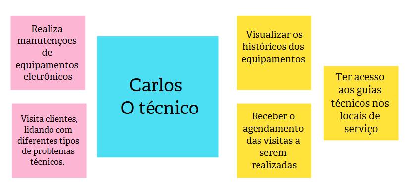
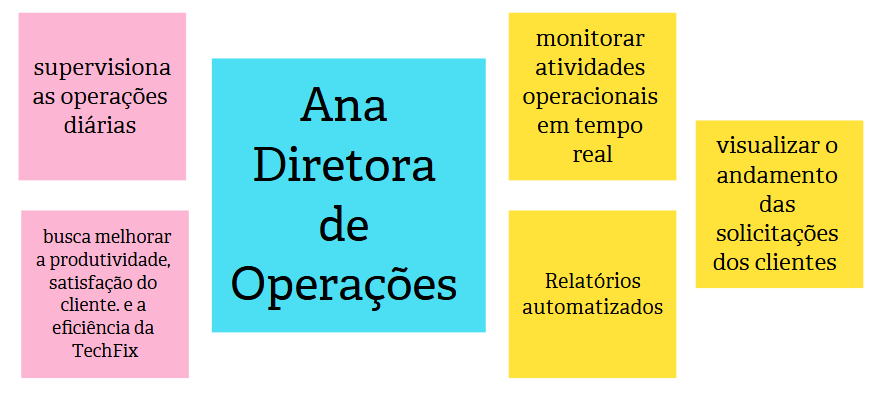
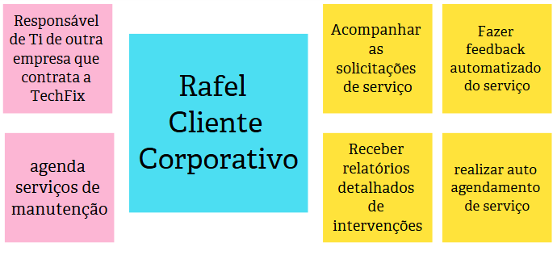
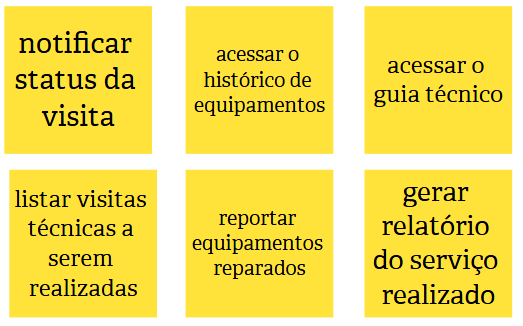
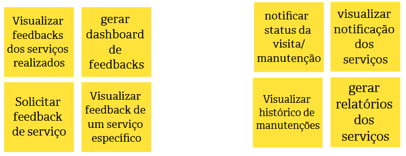
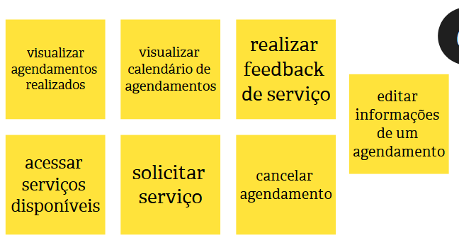

# Estudo de Caso "TechFix"

## Contexto:

A atividade realizada em sala de aula envolveu o desenvolvimento do Product Backlog Building (PBB) para a TechFix, uma empresa especializada em suporte técnico e manutenção de equipamentos para clientes corporativos e residenciais. Apesar de sua reconhecida expertise, a TechFix enfrenta desafios que comprometem sua reputação e eficiência operacional.

> Baseado em "Exercício de Construção de Backlog de Produto usando PBB (Product Backlog Building)" passado em sala de aula pelo Prof. Dr. George Marsicano

## Identificação do Produto:

## Problemas:

## Expectativas:

## Personas:

### Persona 1: Carlos

### Persona 2: Ana

### Persona 3: Rafael

## Funcionalidades:

### Funcionalidades Carlos

### Funcionalidades Ana

### Funcionalidades Rafael

## PBI:

### PBI Carlos

### PBI Ana

### PBI Rafael

## Histórias de Usuários:

