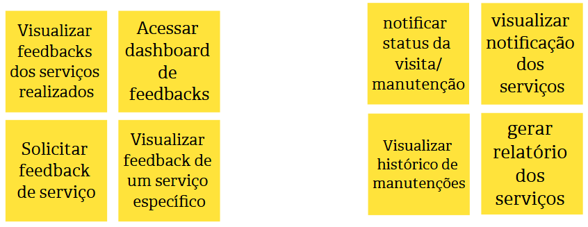

# Estudo de Caso "TechFix"

## Contexto:

A atividade realizada em sala de aula envolveu o desenvolvimento do Product Backlog Building (PBB) para a TechFix, uma empresa especializada em suporte técnico e manutenção de equipamentos para clientes corporativos e residenciais. Apesar de sua reconhecida expertise, a TechFix enfrenta desafios que comprometem sua reputação e eficiência operacional.

> Baseado em "Exercício de Construção de Backlog de Produto usando PBB (Product Backlog Building)" passado em sala de aula pelo Prof. Dr. George Marsicano

## Identificação do Produto:

## Problemas:

## Expectativas:

## Personas:

### Persona 1: Carlos

### Persona 2: Ana

### Persona 3: Rafael

## Funcionalidades:

### Funcionalidades Carlos

### Funcionalidades Ana

### Funcionalidades Rafael

## PBI:

### PBI Carlos

### PBI Ana

### PBI Rafael

## Histórias de Usuários:

### US01 - Notificar status da visita

>Eu, como técnico, quero notificar o status da visita para que a diretora de operações tenha informações do andamento do meu serviço.

Critérios de Aceitação: 

* O técnico deve ser capaz de criar uma mensagem notificando o status da visita, com campos para o título e descrição.
* O sistema deve permitir a inserção de detalhes como a data e hora da visita.
* O status da visita deve ser visível para o diretor de operações.

Cenário: Técnico notifica o status da visita

**Dado que** o técnico está visualizando uma visita agendada.  
**Quando** ele seleciona a visita e insere a mensagem de status "Visita realizada com sucesso!"  
**Então** o sistema deve notificar os envolvidos com a mensagem de status da visita.  

### US02 - Acessar histórico de equipamentos

>Eu, como técnico, quero acessar o histórico de um equipamento para realizar diagnósticos rápido e mais preciso sobre o equipamento. 

Critérios de Aceitação: 

* O técnico deve ser capaz de visualizar o histórico completo de manutenção do equipamento selecionado.
* O histórico deve incluir informações como data, descrição do problema e solução aplicada.
* O técnico deve ser capaz de filtrar o histórico por tipo de equipamento ou data.

Cenário: Técnico acessa o histórico de equipamentos

**Dado que** que o técnico está na página de equipamentos,  
**Quando** ele seleciona o equipamento "Notebook ASUS" do cliente "Gerônimo Peças",    
**Então** o sistema deve exibir a data da última manutenção como "07/12/2024" e o horário como "15:00".  

### US03 - Acessar guia técnico

>Eu, como técnico, quero acessar o guia técnico para ter acesso as informaçoes e procedimentos dos equipamentos.

Critérios de Aceitação: 

* O guia técnico deve ser atualizado mensalmente para refletir as mudanças nos processos.
* O técnico deve poder buscar informações específicas dentro do guia.

Cenário: Técnico acessa o guia técnico

**Dado que** que o técnico está na página do guia,  
**Quando** ele seleciona o "Guia Técnico Linux 2024",  
**Então** o sistema deve exibir um guia com procedimentos e normas técnicos do Linux e a versão do guia deve ser a de 2024.

### US04 - Listar visitar a serem realizadas

>Eu, como técnico, quero listar visitas técnicas a serem realizadas para visualizar os detalhes das mesmas.

Critérios de Aceitação: 

* As visitas devem estar organizadas por data e prioridade.
* O técnico deve poder visualizar detalhes de cada visita, incluindo informações do cliente e serviço.
* O sistema não deve mostrar visitas que forão canceladas.

Cenário: Técnico lista visitas a serem realizadas

**Dado que** o técnico está na página de visitas,  
**Quando** ele acessa a lista de visitas agendadas do dia "21/01/2025",  
**Então** a visita marcada para as "8:00" deve aparecer antes da visita marcada para as "10:00".  

### US05 - Reportar equipamentos reparados

>Eu como técnico quero reportar equipamentos reparados para atualizar o sistema e notificar o diretor de operações.

Critérios de Aceitação: 

* O técnico deve ser capaz de reportar equipamentos reparados, incluindo a descrição do reparo.
* O sistema deve registrar o status do equipamento após o reparo.
* O sistema deve permitir que o técnico envie fotos ou outros anexos relacionados ao reparo.

Cenário : Técnico reporta equipamentos reparados

**Dado que** o técnico finalizou o reparo de um equipamento,  
**Quando** ele insere as informações em nome do equipamento "Impressora 3D" e marca o equipamento como "Reparado",  
**Então** o sistema deve registrar o reparo e atualizar o status do equipamento para "Reparado".  

### US06 - Gerar relatório de serviço

>Eu, como técnico, quero gerar relatório do serviço realizado para informar e atualizar o sistema.

Critérios de Aceitação: 

* O técnico deve poder gerar relatórios detalhados sobre os serviços realizados, incluindo manutenções e reparos.
* Os relatórios devem incluir data, hora, descrição do serviço, equipamentos envolvidos e status.
* O sistema deve permitir exportar os relatórios.

### US07 - Visualizar feedback geral dos serviços 

>Eu, como diretora de operações, quero visualizar feedbacks dos serviços realizados para obter melhores insights baseado em nos dados obtidos.

Critérios de Aceitação: 

* A diretora de operações deve poder acessar todos os feedbacks recebidos sobre os serviços realizados.
* Os feedbacks devem estar organizados por data e serviço.
* A diretora deve poder filtrar feedbacks por tipo de serviço ou técnico.

### US08 - Gerar dashboard de feedbacks

>Eu, como diretora de operações, quero gerar dashboard de feedbacks para melhor visualizar as avaliações.

Critérios de Aceitação: 

* O sistema deve gerar um painel de controle que exiba as avaliações médias dos serviços.
* O dashboard deve permitir a visualização de tendências de feedback ao longo do tempo.
* A diretora deve ser capaz de filtrar os dados do dashboard por técnico, serviço ou período.

### US09 - Solicitar feedback

>Eu, como diretora de operações, quero solicitar feedback de serviço para melhorar os serviços prestados.

Critérios de Aceitação: 

* A diretora de operações deve poder enviar uma solicitação de feedback para clientes após a conclusão de um serviço.
* O sistema deve permitir personalizar a mensagem de solicitação de feedback.
* O cliente deve receber a solicitação de feedback por e-mail ou notificação no sistema.

### US10 - Visualizar feedback de serviço

>Eu, como diretora de operações, quero visualizar feedback de um serviço específico para obter informações sobre cada caso

Critérios de Aceitação: 

* A diretora de operações deve ser capaz de visualizar todos os feedbacks de um serviço específico.
* O sistema deve permitir a visualização detalhada de cada feedback, incluindo comentários e avaliações.
* A diretora deve poder filtrar feedbacks de um serviço específico por data e cliente.

### US11 - Notificar status da visita

>Eu, como diretora de operações, quero notificar status da visita/manutenção para atualizar os técnicos e sistema

Critérios de Aceitação: 

* A diretora de operações deve ser capaz de notificar o status de uma visita ou manutenção, incluindo o andamento ou a conclusão.
* O sistema deve permitir que a notificação seja enviada para todos os envolvidos.
* O status da visita ou manutenção deve ser atualizado no sistema imediatamente após a notificação.

### US12 - Visualizar histórico de manutenção

>Eu, como diretora de operações, quero visualizar históricos das manutenções para obter informações dos serviços realizados.

### US13 - Visualizar notificação do serviço

>Eu, como diretora de operações, quero visualizar notificações dos serviços para visualizar mudanças e atualizações.

### US14 - Gerar relatório de serviço

>Eu, como diretora de operações, quero gerar relatórios dos serviços para mapear melhorias.

### US15 - Visualizar agendamentos

>Eu, como cliente quero visualizar, agendamentos realizados para obter informações dos serviços agendados.

### US16 - Visualizar calendários

>Eu, como cliente quero visualizar, calendário de agendamentos para ter informações sobre a isponibilidade de serviços

### US17 - Gerar feedback

>Eu, como cliente, quero realizar feedback de um serviço para otimizar o processo de agendamento

### US18 - Editar agendamentos

>Eu, como cliente, quero editar informações de um agendamento caso algum imprevisto aconteça. 

### US19 - Acessar serviços

>Eu, como cliente, quero acessar serviços disponíveis para otimizar o processo de agendamento.

### US20 - Solicitar serviços

>Eu, como cliente, quero solicitar serviços para realizar o auto agendamento.

### US21 - Cancelar agendamento

>Eu, como cliente, quero cancelar agendamento caso tenha desistido do serviço.

*Histórico de Revisão*

| Data | Versão | Descrição | Autores |
| ---------- | ----------- | -------------- | -------------- |
| 20/01/2025 | 1.0 | Criação do documento de PBB no gitpages | Bruno de Oliveira, Cairo Florenço, João Pedro |

