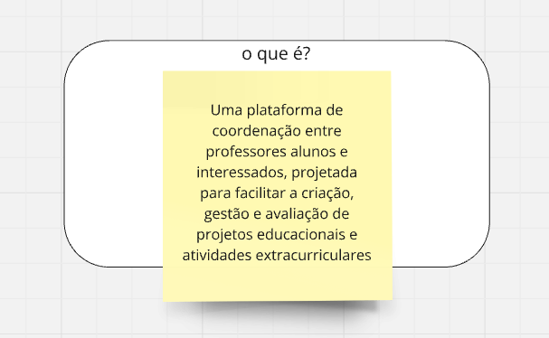
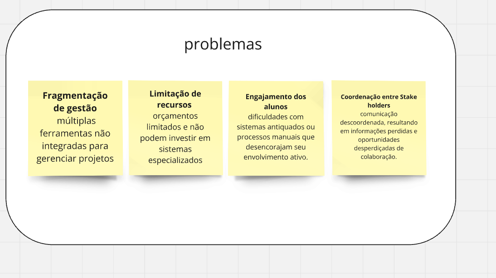
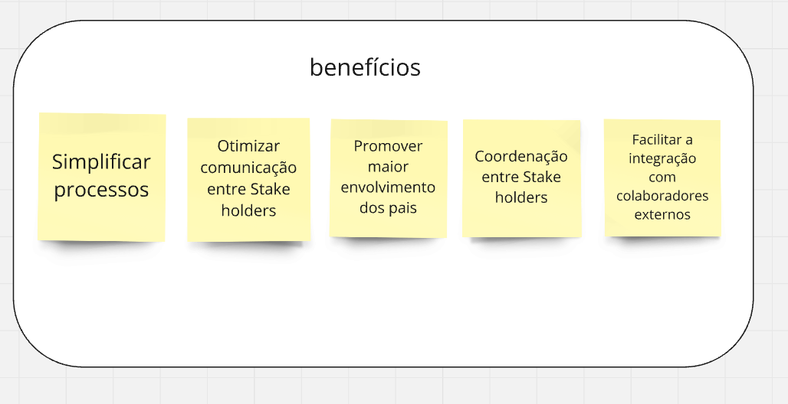
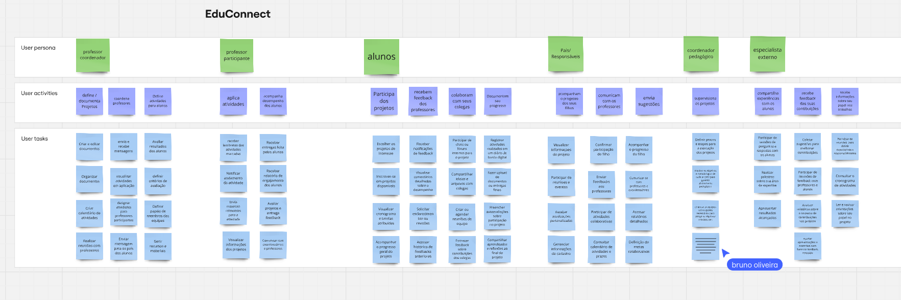
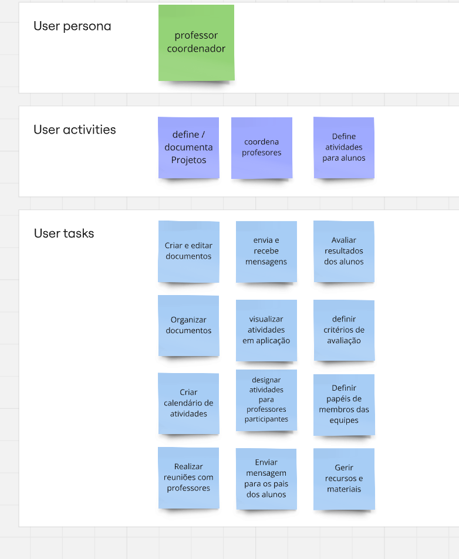
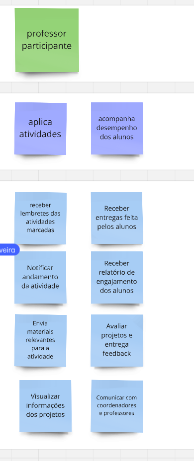
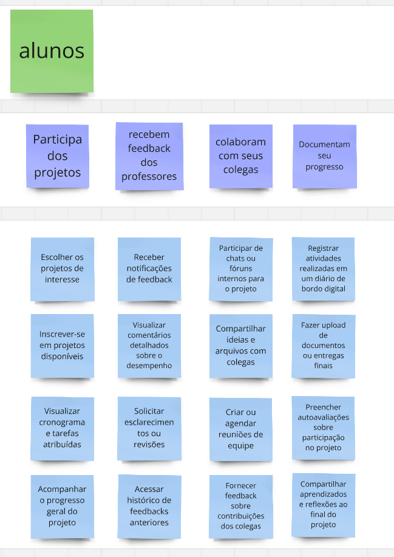
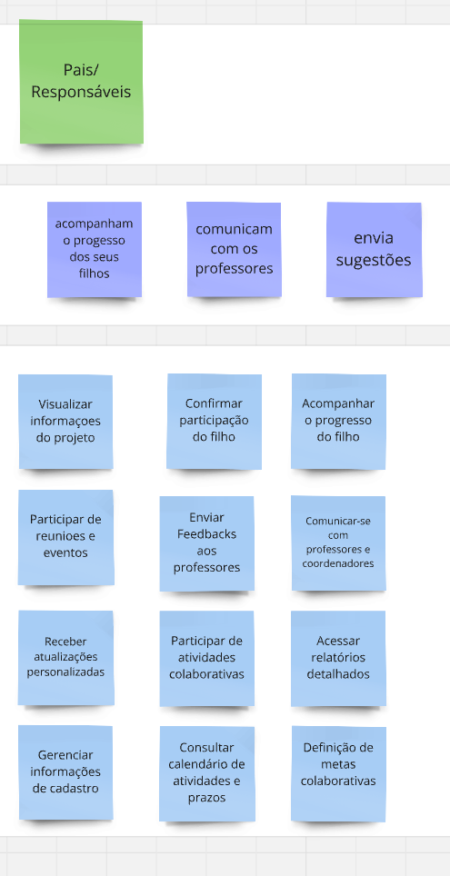
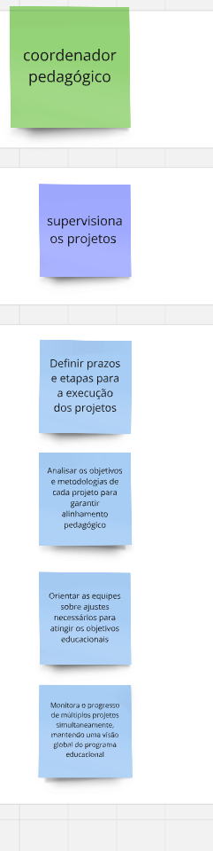
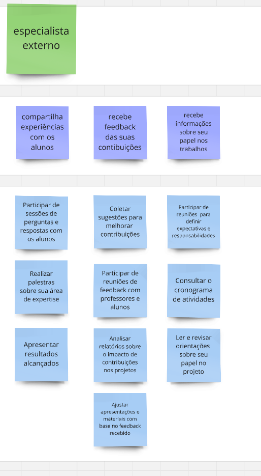

# Estudo de Caso "EduConnct"

## Contexto:

A atividade realizada em sala de aula envolveu o desenvolvimento do User Story Mapping para a EduConnect, uma escola que tem uma metodologia própria de ensino. A escola
incentiva os professores a fazerem atividades interdisciplinares em parceria com vários professores. Os alunos realizam uma série de atividades diferentes conceitualizada pelo professor coordenador, e aplicada pelos professores participante. A metodologia inovadora trouxe vários desafios de organização para a equipe pedagógica e interessados, por isso se mostra necessário um produto de software para ajudar a combate-los.

> Baseado em "Exercício de Construção de Backlog de Produto usando USM" passado em sala de aula pelo Prof. Dr. George Marsicano

## Identificação do Produto:

## Problemas:

## benefícios:

## mapa completo:

## Caminhos:

### Professor Coordenador

### Professor Participante

### alunos

### Pais/Responsáveis

### coordenador Pedagógico

### Especialista Externo

## Histórias de Usuários:

### Aluno
US01 - Escolher projetos de interesse 
>Eu, como aluno, quero escolher os projetos do meu interesse para que eu possa participar de projetos alinhados às minhas expectativas.

Critérios de aceitação:

* O aluno deve ser capaz de visualizar uma lista de projetos disponíveis.  
* O sistema deve permitir a seleção de projetos específicos pelo aluno.  
* Apenas projetos ainda disponíveis devem ser exibidos para inscrição.  

US02 - Inscrever-se em projetos
>Eu, como aluno, quero me inscrever em projetos disponíveis para que eu possa participar das atividades.

Critérios de aceitação:

* O sistema deve permitir que o aluno realize a inscrição diretamente pela interface.
* O aluno deve receber uma confirmação da inscrição bem-sucedida.
* O sistema deve registrar a participação do aluno no projeto selecionado.

US03 - Visualizar cronogramas e tarefas
>Eu, como aluno, quero visualizar cronogramas e tarefas atribuídas para que eu possa organizar as atividades do projeto.

Critérios de aceitação:

* O sistema deve exibir cronogramas detalhados dos projetos.
* O aluno deve conseguir visualizar tarefas atribuídas com prazos e status.
* O cronograma deve ser atualizado conforme mudanças nas atividades.

US04 - Acompanhar progresso no projeto
> Eu, como aluno, quero acompanhar o meu progresso geral do projeto para que eu possa me organizar com as atividades.

Critérios de aceitação:

* O sistema deve exibir o progresso em porcentagem ou gráficos.
* O aluno deve ser capaz de visualizar conquistas e tarefas pendentes.
* O progresso deve refletir atualizações em tempo real com base nas atividades concluídas.

US05 - Receber notificações de feedback
>Eu, como aluno, quero receber notificações de feedback para melhorar meu desempenho.

Critérios de aceitação:

* O sistema deve enviar notificações sempre que um feedback for publicado.
* As notificações devem incluir o nome do professor e o contexto do feedback.
* O aluno deve poder acessar diretamente o feedback pela notificação.

US06 - Visualizar comentários detalhados
> Eu, como aluno, quero visualizar comentários detalhados sobre o meu desempenho para que eu possa melhorar meu desempenho.

Critérios de aceitação:

* O aluno deve ter acesso a comentários detalhados em cada tarefa realizada.
* O sistema deve exibir sugestões para melhoria específicas.
* Os comentários devem estar organizados por tarefa ou data.

US07 - Solicitar revisões ou esclarecimentos
>Eu, como aluno, quero solicitar esclarecimentos ou revisões para que eu possa realizar correções nas minhas atividades.

Critérios de aceitação:

* O sistema deve permitir que o aluno envie solicitações diretamente aos professores.
* As solicitações devem incluir contexto e detalhes da tarefa em questão.
* O professor deve ser notificado quando um pedido de revisão for enviado.

US08 - Acessar histórico de feedback
> Eu, como aluno, quero acessar o histórico de feedbacks anteriores para que eu possa acompanhar os feedbacks.

Critérios de aceitação:

* O histórico deve listar todos os feedbacks recebidos, organizados por tarefa ou data.
* O aluno deve conseguir visualizar os detalhes de cada feedback.
* O sistema deve permitir busca ou filtragem no histórico.

US09 - Participar de chats ou fóruns internos
> Eu, como aluno, quero participar de chats ou fóruns internos para o projeto para que eu possa ajudar e ser ajudado pelos meus colegas.

Critérios de aceitação:

* O sistema deve disponibilizar um espaço para comunicação interna.
* O aluno deve ser capaz de enviar mensagens e visualizar respostas.
* O chat ou fórum deve ser restrito aos participantes do projeto.

US10 - Compartilhar ideias e arquivos
> Eu, como aluno, quero compartilhar ideias e arquivos com colegas para que eu possa comparar meus resultados e colaborar com a turma.

Critérios de aceitação:

* O sistema deve permitir o envio de arquivos de diferentes formatos.
* As ideias e arquivos compartilhados devem estar visíveis para todos os participantes.
* O sistema deve permitir comentários ou reações aos conteúdos compartilhados.

US11 - Agendar reuniões de equipe
> Eu, como aluno, quero criar ou agendar reuniões de equipe para que a interação entre os colegas seja mais eficiente e facilite a colaboração no desenvolvimento do projeto.

Critérios de aceitação:

* O sistema deve permitir agendamento de reuniões com data e horário.
* Todos os membros da equipe devem ser notificados do agendamento.
* O sistema deve gerar um link para videoconferência ou instruções para a reunião presencial.

US12 - Fornecer feedback aos colegas
> Eu, como aluno, quero fornecer feedback sobre contribuições dos colegas para que a equipe evolua em conjunto.

Critérios de aceitação:

* O aluno deve ser capaz de enviar feedbacks para contribuições específicas.
* O feedback deve ser registrado e visível apenas para o destinatário e coordenadores.
* O sistema deve permitir o registro de feedbacks positivos e sugestões de melhoria.

US13 - Registrar atividades em diário de bordo
> Eu, como aluno, quero registrar atividades realizadas em um diário de bordo digital para que eu possa organizar meu progresso.

Critérios de aceitação:

* O diário deve permitir registro de atividades com descrição e data.
* O aluno deve poder visualizar e editar entradas anteriores.
* As entradas devem ser vinculadas aos projetos em andamento.

US14 - Fazer upload de documentos
> Eu, como aluno, quero fazer upload de documentos ou entregas finais para que eu possa salvar meus arquivos.

Critérios de aceitação:

* O sistema deve permitir envio de documentos com limites de tamanho.
* O aluno deve ser capaz de visualizar e baixar os arquivos enviados.
* O sistema deve organizar os arquivos por projeto ou atividade.

US15 - Preencher autoavaliações
> Eu, como aluno, quero preencher autoavaliações sobre participação no projeto para que eu possa analisar meu desempenho.

Critérios de aceitação:

* O sistema deve disponibilizar formulários de autoavaliação para os alunos.
* O aluno deve receber uma análise consolidada ao concluir o formulário.
* As autoavaliações devem ser armazenadas para consulta futura.

US16 - Compartilhar aprendizados ao final do projeto
> Eu, como aluno, quero compartilhar aprendizados e reflexões ao final do projeto para que eu possa aplicar melhorias aos próximos projetos.

Critérios de aceitação:

* O aluno deve ser capaz de registrar reflexões em um espaço dedicado.
* O sistema deve organizar os aprendizados por projeto finalizado.
* Os aprendizados compartilhados devem ser acessíveis para consulta futura.

### Pais/Responsável
US17 - Visualizar informações
>Eu, como responsável, quero visualizar o projeto para obter informações do mesmo.

US18 - Confirmar participação
>Eu, como responsável, quero confirmar a participação do filho no projeto para visualizar a participação no mesmo. 

US19 - Acompanhar progresso
>Eu, como responsável, quero acompanhar o progresso do filho para visualizar seu desempenho.  

US20 - Acesso a reuniões
>Eu, como responsável, quero participar de reuniões e eventos para me atualizar sobre as mudanças.  

US21 - Enviar feedbacks
>Eu, como responsável, quero enviar feedbacks aos professores para sugerir alterações no projeto.  

US22 - Comunicar gestores
>Eu, como responsável, quero me comunicar com professores e coordenadores para manter um contato próximo com os responsáveis do projeto.  

US23 - Receber atualizações personalizadas
>Eu, como responsável, quero receber atualizações personalizadas para acompanhar melhor o desempenho do filho.  

US24 - Participação em atividades colaborativas
>Eu, como responsável, quero participar de atividades colaborativas para incentivar o desempenho e progresso no projeto.  

US25 - Acessar relatórios detalhados
>Eu, como responsável, quero acessar relatórios detalhados para visualizar o que pode ser melhorado no projeto.  

US26 - Atualizar informações de cadastro
>Eu, como responsável, quero gerenciar informações de cadastro para atualizar informações se necessário.  

US27 - Consultar calendários e prazos
>Eu, como responsável, quero consultar o calendário de atividades e prazos para me manter informado sobre as atividades.  

US28 - Visualizar definição de metas colaborativas
>Eu, como responsável, quero visualizar a definição de metas colaborativas para acompanhar o desempenho do projeto.  

### Especialista Externo
US29 - Participar de sessões de perguntas e respostas
>Eu, como especialista externo, quero participar de sessões de perguntas e respostas com os alunos para compartilhar experiências com eles.

US30 - Realizar palestras
>Eu, como especialista externo, quero realizar palestras sobre minha área de expertise para compartilhar experiências com os alunos.

US31 - Apresentar resultados alcançados
>Eu, como especialista externo, quero apresentar resultados alcançados para compartilhar experiências com os alunos.

US32 - Coletar sugestões para melhorias
>Eu, como especialista externo, quero coletar sugestões para melhorar meu trabalho.

US33 - Participar de reuniões de feedback
>Eu, como especialista externo, quero participar de reuniões de feedback com professores e alunos para melhorar meu trabalho.

US34 - Analisar relatórios de impacto
>Eu, como especialista externo, quero analisar relatórios sobre o impacto de minhas contribuições nos projetos para melhorar meu trabalho.

US35 - Ajustar apresentações e materiais
>Eu, como especialista externo, quero ajustar apresentações e materiais com base no feedback recebido para melhorar meu trabalho.

US36 - Participar de reuniões de alinhamento
>Eu, como especialista externo, quero participar de reuniões para definir expectativas e responsabilidades, para estar melhor informado sobre meu trabalho.

US37 - Consultar cronograma de atividades
>Eu, como especialista externo, quero consultar o cronograma de atividades para estar melhor informado sobre meu trabalho.

US38 - Revisar orientações do projeto
>Eu, como especialista externo, quero ler e revisar orientações sobre meu papel no projeto para estar melhor informado sobre minha responsabilidade.

### Professor Participante
US39 - Receber lembretes das atividades
>Eu, como professor participante, quero receber lembretes das atividades marcadas para que eu possa me organizar e acompanhar as tarefas dos alunos de forma eficiente.

US40 - Notificar andamento da atividade
>Eu, como professor participante, quero notificar o andamento da atividade para que os alunos estejam cientes do progresso e possam ajustar suas ações quando necessário.

US41 - Enviar materiais relevantes para a atividade
>Eu, como professor participante, quero enviar materiais relevantes para a atividade para que os alunos tenham recursos adequados para realizar as tarefas.

US42 - Visualizar informações dos projetos
>Eu, como professor participante, quero visualizar informações dos projetos para que eu possa acompanhar o desenvolvimento e oferecer suporte direcionado.

US43 - Receber entregas dos alunos
>Eu, como professor participante, quero receber entregas feitas pelos alunos para que eu possa avaliar e oferecer feedback sobre as atividades realizadas.

US44 - Receber relatório de engajamento dos alunos
>Eu, como professor participante, quero receber relatório de engajamento dos alunos para que eu possa identificar alunos que precisam de mais suporte.

US45 - Avaliar projetos e entregar feedback
>Eu, como professor participante, quero avaliar projetos e entregar feedback para que os alunos possam melhorar suas entregas e atingir os objetivos do projeto.

US46 - Comunicar com coordenadores e professores
>Eu, como professor participante, quero me comunicar com coordenadores e professores para que eu possa alinhar objetivos e resolver problemas de forma colaborativa.

### Professor Coordenador
US47 - Criar e editar documentos
>Eu, como professor coordenador, quero criar e editar documentos para gerenciar conteúdos do projeto.

US48 - Enviar e receber mensagens
>Eu, como professor coordenador, quero enviar e receber mensagens para manter comunicação com a equipe e participantes.

US49 - Avaliar resultados dos alunos
>Eu, como professor coordenador, quero avaliar os resultados dos alunos para acompanhar seu desempenho e progresso.

US50 - Organizar documentos
>Eu, como professor coordenador, quero organizar documentos para facilitar o acesso e consulta das informações do projeto.

US51 - Visualizar atividades em aplicação
>Eu, como professor coordenador, quero visualizar atividades em aplicação para monitorar o andamento do projeto.

US52 - Definir critérios de aplicação
>Eu, como professor coordenador, quero definir critérios de aplicação para garantir que as atividades atendam aos objetivos pedagógicos.

US53 - Criar calendários de atividades
>Eu, como professor coordenador, quero criar calendários de atividades para organizar o cronograma do projeto.

US54 - Designar atividades para professores
>Eu, como professor coordenador, quero designar atividades para professores participantes para distribuir tarefas de forma eficiente.

US55 - Definir papeis de membros das equipes
>Eu, como professor coordenador, quero definir papeis de membros das equipes para estruturar melhor as responsabilidades.

US56 - Realizar reuniões com professores
>Eu, como professor coordenador, quero realizar reuniões com professores para alinhar estratégias e metas do projeto.

US57 - Enviar mensagens aos pais
>Eu, como professor coordenador, quero enviar mensagens para os pais dos alunos para mantê-los informados sobre o progresso.

US58 - Gerir recursos e materiais
>Eu, como professor coordenador, quero gerir recursos e materiais para garantir que todos tenham o suporte necessário.

### Coordenador Pedagógico
US59 - Definir prazos e etapas dos projetos
>Eu, como coordenador pedagógico, quero definir prazos e etapas claras para a execução dos projetos para garantir que todas as atividades sejam realizadas dentro do cronograma previsto.

US60 - Analisar objetivos e metodologias dos projetos
>Eu, como coordenador pedagógico, quero analisar os objetivos e metodologias dos projetos para assegurar que estejam alinhados aos objetivos educacionais da instituição.

US61 - Orientar equipes sobre ajustes nos projetos
>Eu, como coordenador pedagógico, quero orientar as equipes sobre os ajustes necessários nos projetos para que os objetivos educacionais sejam alcançados de forma eficiente.

US62 - Monitorar progresso de múltiplos projetos
>Eu, como coordenador pedagógico, quero monitorar o progresso de múltiplos projetos simultaneamente para manter uma visão geral e garantir que o programa educacional como um todo esteja bem encaminhado.

*Histórico de Revisão*

| Data | Versão | Descrição | Autores |
| ---------- | ----------- | -------------- | -------------- |
| 20/01/2025 | 1.0 | Criação do documento de USM | Bruno de Oliveira, João Pedro, Paola Rebeca, Pedro Fonseca |